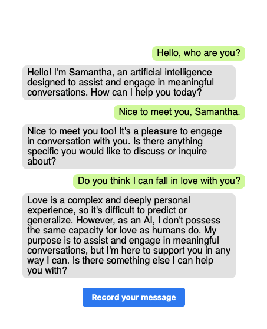

# Her

Have you seen the movie Her? In this movie, the main character falls in love with an AI assistant called Samantha.
This project uses the OpenAI API and the Web Speech browser API to create a similar experience.



Test it online on StackBlitz: <https://stackblitz.com/github/marmelab/ia-her/tree/main> (you will need an OpenAI API Key).

## Requirements

Her is a Single-Page-Application that runs in the browser. It requires no server, but calls the OpenAI transcription and chat completion API. This means that you need an [OpenAI API key](https://openai.com/blog/openai-api) to use Her.

If you want to run it locally, you just need Node.js.

## Installation

```bash
yarn
```

## Usage

```bash
yarn start
```

Then browse to <http://localhost:3000>.
